# 🎵 Music Recommender Simulation

## Project Summary

This version of the music recommender uses content-based filtering to suggest songs from a small catalog of 20 tracks. It scores each song based on how well it matches a user's preferred genre, mood, energy level, and acoustic preference, then returns the top 5 recommendations with explanations. The system emphasizes energy closeness after a recent experiment that doubled its weight, making it more sensitive to energy targets but potentially creating filter bubbles around high-energy songs.

## How The System Works

Real music apps like Spotify and YouTube dont just pick songs at random. They look at what other people with similar taste are listening to, and what the actual song sounds like compared to things you already enjoy. Collaborative filtering is great at helping you discover unexpected songs you might not find on your own but it needs tons of user data to work. Content-based filtering can work right away because it just compares song features to your preferences but it tends to keep recommending the same kind of thing over and over.

My version focuses on content-based filtering because I'm working with a small catalog of 20 songs and dont have data from other users. The system takes two inputs, a user taste profile and the song catalog, runs every song through a scoring formula, then sorts the results and returns the top 5.

### Features

Song features used for scoring:
- `genre` (string) - the songs genre like pop, lofi, rock, metal, hip-hop, folk, blues, etc
- `mood` (string) - the feeling of the song like happy, chill, intense, aggressive, soulful, dreamy, etc
- `energy` (float, 0.0 to 1.0) - how intense or calm the song sounds
- `acousticness` (float, 0.0 to 1.0) - how acoustic vs electronic the song is

Song features stored but not scored:
- `tempo_bpm`, `valence`, `danceability` - these overlap too much with energy and mood so including them would double count the same information

UserProfile preferences:
- `favorite_genre` (string) - the genre the user identifies with most
- `favorite_mood` (string) - the mood the user is looking for right now
- `target_energy` (float, 0.0 to 1.0) - not a minimum or maximum but a target, songs closer to this value score higher
- `likes_acoustic` (bool) - whether the user prefers organic acoustic sound or electronic produced sound

### Algorithm Recipe

The system uses additive point scoring. Each song starts at 0 points and earns points for each feature that matches or is close to the users preferences:

- **Genre match: +1.0 points** - if the songs genre exactly matches the users favorite genre. This is a moderate weight after reducing it from 2.0 to balance with energy.
- **Mood match: +1.0 point** - if the songs mood matches the users preferred mood. Mood is now equal to genre in importance.
- **Energy closeness: up to +2.0 points** - calculated as `2.0 * (1.0 - |user_target - song_energy|)`, clamped to non-negative. This rewards proximity strongly, with perfect matches getting full points and large gaps getting zero.
- **Acoustic fit: up to +0.5 points** - calculated as `0.5 x song_acousticness` if the user likes acoustic or `0.5 x (1.0 - song_acousticness)` if they prefer electronic. Lowest weight because production style is more of a texture preference than a dealbreaker.
- **Popularity bonus: up to +0.5 points** - based on song popularity (0-100), scaled to 0-0.5.
- **Artist popularity bonus: up to +0.25 points** - based on artist popularity (0-100), scaled to 0-0.25.
- **Detailed mood tag match: +0.5 points** - if the user's mood appears in the song's detailed mood tags.
- **Modern release bonus: +0.3 points** - for songs released in 2020 or later.
- **Ideal length bonus: +0.2 points** - for songs between 180-240 seconds.
- **English language bonus: +0.1 points** - for English-language songs.
- **Explicit content penalty: -0.5 points** - subtracted for explicit songs.

Maximum possible score: **~6.0 points** (all bonuses except penalty)

After scoring all 20 songs the system sorts them highest to lowest and returns the top k (default 5).

### Data Flow

```
INPUT                          PROCESS                         OUTPUT
─────                          ───────                         ──────
songs.csv (20 songs)  ──┐
                        ├──>  For each song:                  Sort all 20 scored
User Preferences  ──────┘       Check genre   (+1.0 or 0)     songs by score
  genre: "pop"                  Check mood    (+1.0 or 0)      descending
  mood: "happy"                 Calc energy   (+0.0 to 2.0)         │
  energy: 0.80                  Calc acoustic (+0.0 to 0.5)         v
  likes_acoustic: false         Sum = total score              Return top 5
                                                               with explanations
```

### Expected Biases and Limitations

This system has a few biases that come directly from its design choices:

- **Genre dominance** - at 2.0 points genre is worth more than mood and energy combined (1.0 + 1.0). This means a song in the right genre with the wrong mood will almost always outrank a song with the perfect mood in the wrong genre. For example a pop/intense song beats an indie-pop/happy song for a pop/happy user even though the second one nails the mood. This could cause the system to miss great cross-genre recommendations.
- **No concept of similar genres** - the system treats genre as all or nothing. Rock and metal get zero credit for being related. Lofi and ambient get zero credit for being related. A real listener who likes rock probably also likes metal but the system has no way to know that.
- **Same problem with mood** - chill, relaxed, peaceful, and focused are all in the same neighborhood but the system treats them as completely different. A chill user gets nothing from a relaxed song.
- **Filter bubble** - because this is content-based filtering it can only recommend things that look like what you already said you like. It will never suggest something surprising or help you discover a new genre the way collaborative filtering could.
- **Single taste profile** - real people have layered preferences like mostly lofi but sometimes jazz. The system only accepts one genre and one mood so it cant represent that kind of complexity.
- **Small catalog bias** - with only 20 songs most genres have exactly one song. If that one song has low energy and the user wants high energy there is nothing else in that genre to fall back on.
- **Acoustic preference is too blunt** - its a boolean applied to a spectrum. There is no way to say mostly acoustic but a little production is fine.

---

## Getting Started

### Setup

1. Create a virtual environment (optional but recommended):

   ```bash
   python -m venv .venv
   source .venv/bin/activate      # Mac or Linux
   .venv\Scripts\activate         # Windows

2. Install dependencies

```bash
pip install -r requirements.txt
```

3. Run the app:

```bash
python -m src.main
```

Phase 3 Output:
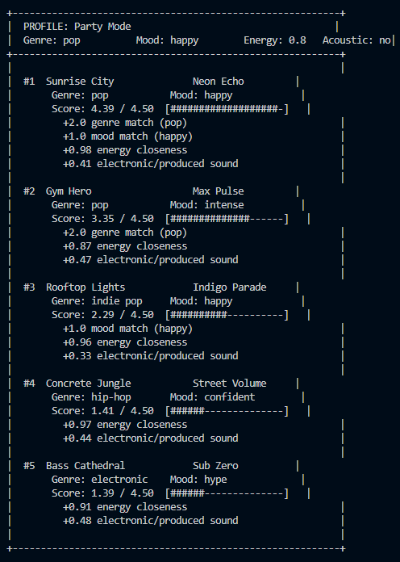
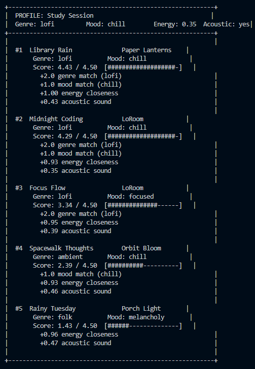
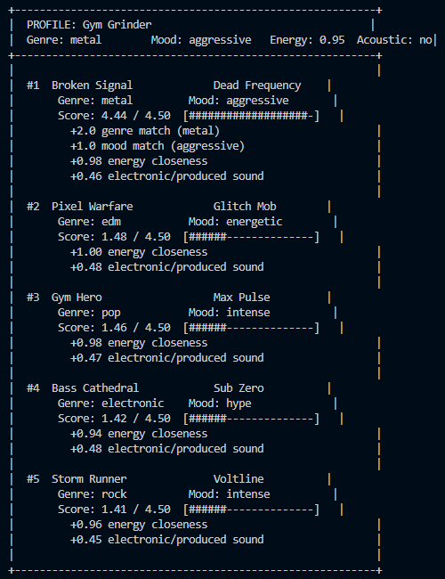
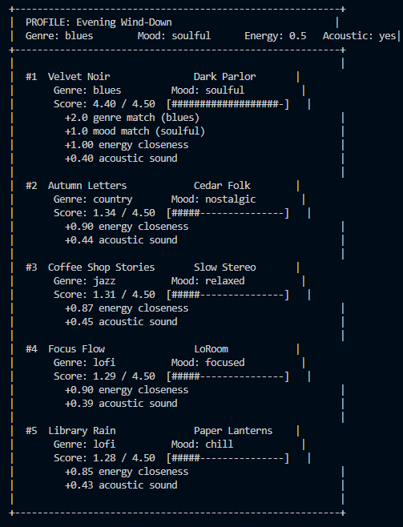
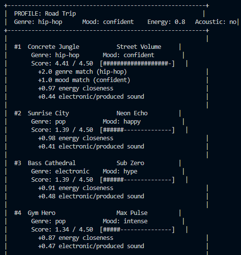
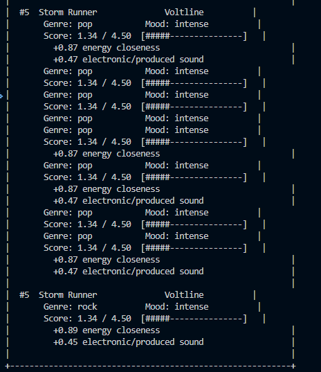

Phase 4 Output:
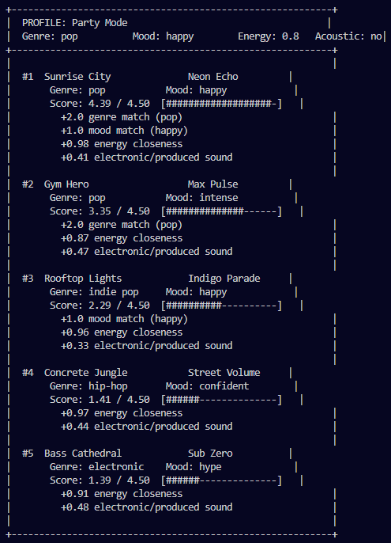
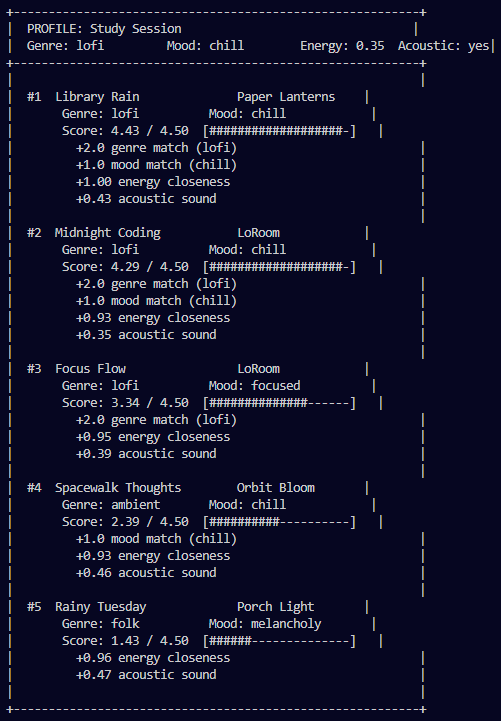
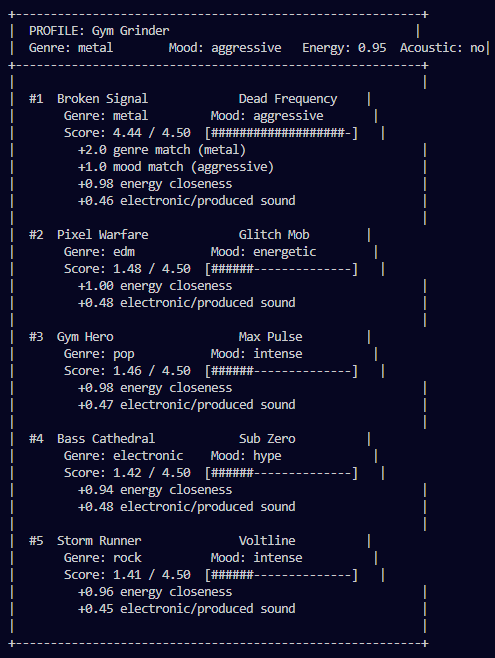
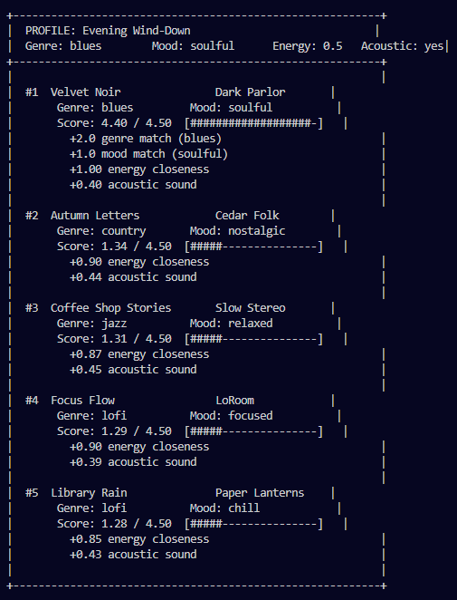
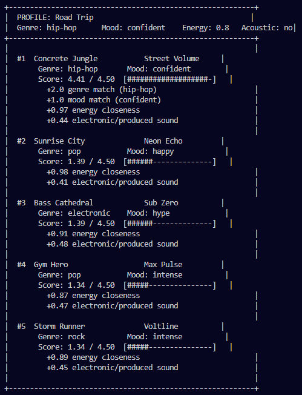
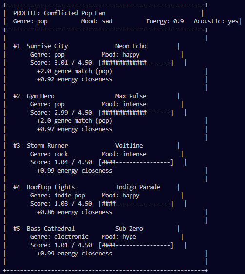
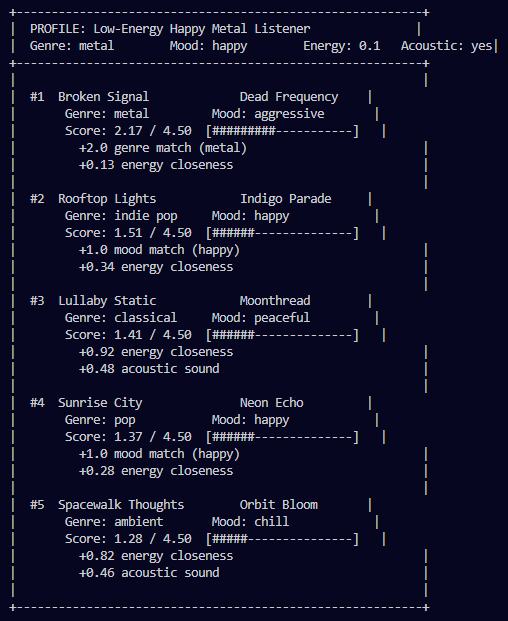
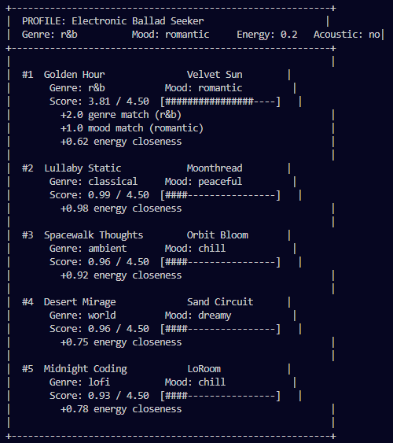
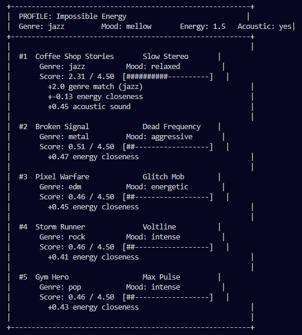
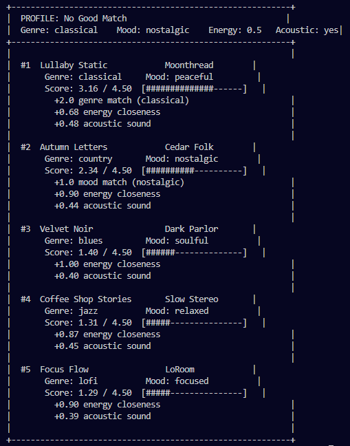

### Running Tests

Run the starter tests with:

```bash
pytest
```

You can add more tests in `tests/test_recommender.py`.

---

## Experiments You Tried

Use this section to document the experiments you ran. For example:

- What happened when you changed the weight on genre from 2.0 to 0.5
- What happened when you added tempo or valence to the score
- How did your system behave for different types of users

### Recent experiment

- Weight-shifted genre from +2.0 to +1.0 and energy from up to +1.0 to up to +2.0.
- Running `python -m src.main` after this change showed stronger promotion of songs with energy closer to the target, even when genre did not match exactly.
- This change feels more like a behavioral shift than an obvious accuracy improvement: it makes recommendations different by favoring energy alignment, but the resulting top songs are not clearly more “correct” in every profile.

---

## Limitations and Risks

This recommender has several limitations that could make it unfair or ineffective in real use. It only works with a tiny catalog of 20 songs, so it can't handle diverse tastes or rare genres well. The system doesn't consider lyrics, artist popularity, or cultural context, which are important for music recommendations. It might over-favor high-energy songs due to the recent weight changes, creating a bias toward intense music even for users who prefer calm tracks. There's also a risk of filter bubbles, where users only get similar songs and miss out on new discoveries.

## Reflection

My biggest learning moment was realizing how small changes in scoring weights can completely shift what the system recommends even if the math stays valid.

AI tools like Claude helped me quickly generate code edits and explanations, but I had to double check them for edge cases, like ensuring the energy formula didnt go negative. Sometimes suggested overly complex solutions that I simplified.

What surprised me was how even a basic additive scoring system could produce recommendations that "felt" right for some profiles. It made me understand why real recommenders start simple and iterate.

If I extended this project, Id try adding partial credit for similar genres using a lookup table, and experiment with user feedback loops to adjust weights dynamically based on what people actually like.


# 🎧 Model Card - Music Recommender Simulation

## 1. Model Name

**Vybes 1.0**

---

## 2. Intended Use

This recommender suggests songs from a small catalog based on a user's favorite genre, mood, energy level, and acoustic preference. It is meant for classroom exploration and testing ideas, not for a real music service. The system assumes the user has a single genre and mood they want right now.

---

## 3. How It Works (Short Explanation)

The model compares each song to the user's tastes and gives points for matching features. It gives points for exact genre and mood matches, and extra points when song energy is close to the user's target. Acoustic songs get a small bonus if the user likes acoustic sound. The final score is the sum of these bonuses, and songs are ranked by that score.

---

## 4. Data

The dataset is a small catalog of 20 songs in `data/songs.csv`. It includes genres like pop, lofi, rock, metal, jazz, hip-hop, electronic, and more. Each song also has mood labels, energy, tempo, valence, danceability, and acousticness. The dataset is limited because it only has one mood and one genre per song, and it does not represent every possible listening style.

---

## 5. Strengths

The system works well when the user wants a clear genre and mood, such as happy pop or chill lofi. It can also surface good matches when a song is very close in energy to the user's target. The scoring is easy to understand, so it is useful for learning how recommendation logic works.

---

## 6. Limitations and Bias

The current scoring system can create a strong filter bubble by over-prioritizing songs with energy close to the user target. This means users with niche or extreme energy preferences may still see recommendations dominated by a small set of songs, even if the genre or mood is not a great fit. The model also treats genre and mood as exact matches only, so similar genres like pop and indie pop or related moods like chill and relaxed get no partial credit. That causes the system to ignore a lot of reasonable alternatives in the catalog and can leave some user profiles with weaker results.

---

## 7. Evaluation

I tested several representative profiles from `src/main.py`, including Party Mode, Study Session, Gym Grinder, Conflicted Pop Fan, Evening Wind-Down, Road Trip, Impossible Energy, and No Good Match. I checked whether the top results matched the stated genre, mood, energy, and acoustic preference for each profile. What surprised me was how often high energy alone could surface strong recommendations for users who did not share that genre or mood exactly, especially after the energy weight increase. I also noticed that a song like Gym Hero keeps showing up for people who want happy pop because it is both pop and very close to the requested high energy level. These experiments helped me see how the score balance affects whether recommendations feel valid or just different.

---

## 8. Future Work

- Add partial credit for similar genres and moods so related songs can count.
- Use a softer energy gap so extreme or unusual targets do not drop all songs to zero.
- Add a diversity penalty so the top list does not repeat the same style too much.

---

## 9. Personal Reflection

I learned that simple recommendation logic can still be useful, but it can also be biased by how points are weighted. It was interesting to see how energy became more important when I changed the score rules. This made me realize real music recommenders need to balance many factors, not just one strong preference.

