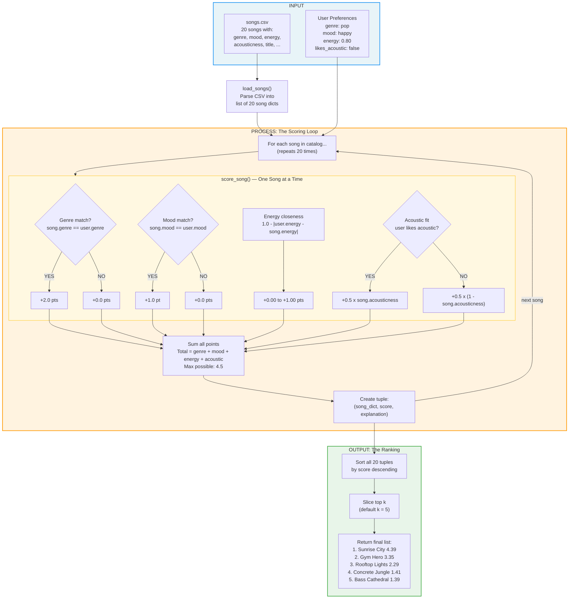

# Data Flow: From User Preferences to Top Recommendations

## Written Map

### INPUT

Two data sources enter the system:

1. **songs.csv** (20 songs) -- loaded by `load_songs()` into a list of dictionaries.
   Each song carries: genre, mood, energy, acousticness (scored) + title, artist, id, tempo, valence, danceability (stored but not scored).

2. **User Preferences** (a dictionary) -- defined in `main.py`.
   Contains: genre, mood, energy (float target), likes_acoustic (bool).

### PROCESS (The Loop)

`recommend_songs()` iterates through every song in the list.
For each song, it calls `score_song(user_prefs, song)` which runs four checks:

```
For song #1 (Sunrise City):
  Check 1: Does song.genre == user.genre?       pop == pop  --> YES --> +2.0 pts
  Check 2: Does song.mood == user.mood?          happy == happy --> YES --> +1.0 pt
  Check 3: Energy closeness                      1.0 - |0.80 - 0.82| = 0.98 --> +0.98 pts
  Check 4: Acoustic fit (user likes electronic)  0.5 * (1.0 - 0.18) = 0.41 --> +0.41 pts
  TOTAL = 4.39 pts

For song #2 (Midnight Coding):
  Check 1: Does song.genre == user.genre?        lofi == pop --> NO  --> +0.0 pts
  Check 2: Does song.mood == user.mood?           chill == happy --> NO --> +0.0 pts
  Check 3: Energy closeness                       1.0 - |0.80 - 0.42| = 0.62 --> +0.62 pts
  Check 4: Acoustic fit (user likes electronic)   0.5 * (1.0 - 0.71) = 0.15 --> +0.15 pts
  TOTAL = 0.77 pts

...repeat for all 20 songs...
```

Each song exits the loop as a tuple: (song_dict, score, explanation_string).

### OUTPUT (The Ranking)

After all 20 songs are scored:

1. **Sort** the full list by score, highest first.
2. **Slice** the top k results (default k=5).
3. **Return** the final list of (song, score, explanation) tuples.

```
Unsorted scores:                    Sorted + cut to k=5:
  Sunrise City      4.39              1. Sunrise City      4.39
  Midnight Coding   0.77              2. Gym Hero           3.35
  Storm Runner      1.34              3. Rooftop Lights     2.29
  Library Rain      0.70              4. Concrete Jungle    1.41
  Gym Hero          3.35      -->     5. Bass Cathedral     1.39
  Spacewalk         0.55              --- cut here (k=5) ---
  Coffee Shop       0.74              6-20: not returned
  Night Drive       1.34
  ...16 more...
```

---

## Mermaid.js Flowchart


